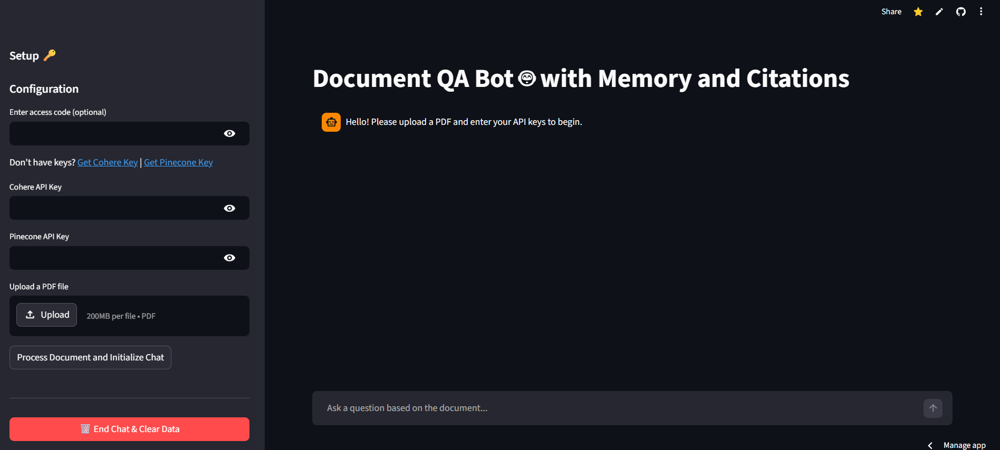
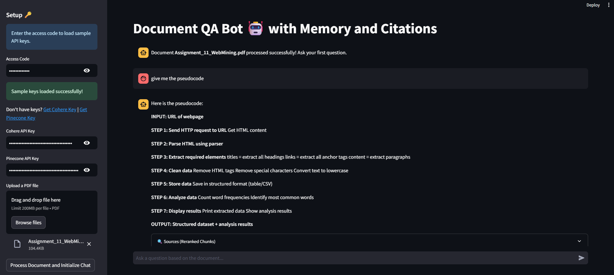
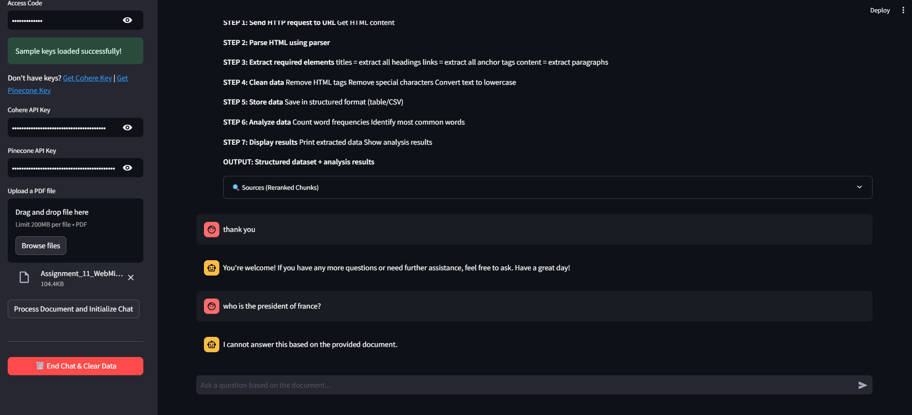

# 🧠 Advanced Agentic RAG Chatbot


An advanced **Retrieval-Augmented Generation (RAG)** chatbot that allows users to upload documents and ask intelligent, context-aware questions using an **Agentic routing system**, **Hybrid search**, and **LLM-powered reasoning**.

---

## 🌐 Live Demo

👉 https://rag-document-question-answering-5xt6uvzd9xfcoffupyrzay.streamlit.app/

### 🧭 How to Use the App

1. Get your API keys:
   - Cohere → https://dashboard.cohere.com/api-keys
   - Pinecone → https://app.pinecone.io/

2. Enter your API keys inside the app UI.

3. Upload a PDF document.

4. Click **"Process Document"**.

5. Click **"Initialize Chat"**.

6. Start asking questions about your document.

---

## 📸 Application Screenshots

> Place your screenshots inside a `docs/` folder in the repo.





---

## ✨ Key Features

- 🤖 **Agentic Intent Routing** (CHAT vs RAG)
- 🔍 **Hybrid Search (Dense + Sparse)**
- 🔁 **Multi-Query Expansion**
- ⚡ **Streaming Responses**
- 📄 **PDF Question Answering**
- 🐳 **Dockerized Deployment**
- 📱 **Mobile-Friendly UI**

---

## 🏗️ Architecture

User Query
↓
Agent Router (CHAT / RAG)
↓
If CHAT → Direct LLM Response
↓
If RAG:
→ Query Expansion
→ Hybrid Search (Pinecone)
→ Retrieve Context
→ Generate Answer (Cohere)
↓
Streaming Response

---

## 🧰 Tech Stack

- **Frontend:** Streamlit
- **LLM:** Cohere (`command-a-03-2025`)
- **Vector DB:** Pinecone
- **Embeddings:** Cohere + Sentence Transformers
- **Document Parsing:** PyMuPDF
- **Orchestration:** LangChain

---

## 🚀 Quickstart (Docker)

### 1. Pull Image

docker pull mauujo/rag-document-question-answering:1.0

### 2. Create `.env`

INTERVIEW_PASSWORD=your_password
COHERE_API_KEY=your_cohere_key
PINECONE_API_KEY=your_pinecone_key

### 3. Run

docker run -p 8501:8501 --env-file .env <YOUR_DOCKERHUB_USERNAME>/advanced-rag-bot:1.0

App runs at: [http://localhost:8501](http://localhost:8501)

---

## 💻 Local Setup

### 1. Clone Repo

git clone https://github.com/MauuJo/RAG-Document-Question-Answering.git
cd RAG-Document-Question-Answering

### 2. Setup Environment

python -m venv venv
source venv/bin/activate # Mac/Linux
venv\Scripts\activate # Windows

### 3. Install Dependencies

pip install -r requirements.txt

### 4. Create `.env`

INTERVIEW_PASSWORD=your_password
COHERE_API_KEY=your_cohere_key
PINECONE_API_KEY=your_pinecone_key

### 5. Run App

streamlit run entrypoint/app.py

---

## ☁️ Deployment (Streamlit Cloud)

1. Connect GitHub repo
2. Add secrets:

COHERE_API_KEY=...
PINECONE_API_KEY=...
INTERVIEW_PASSWORD=...

3. Deploy

---

## 📂 Project Structure

RAG-Document-Question-Answering/
│
├── entrypoint/
│ └── app.py
├── src/
│ ├── chatbot.py
│ ├── retriever.py
│ └── ingestion.py
├── docs/
├── Dockerfile
├── requirements.txt
├── packages.txt
└── README.md

---

## 🔐 Environment Variables

| Variable           | Description      |
| ------------------ | ---------------- |
| COHERE_API_KEY     | Cohere API key   |
| PINECONE_API_KEY   | Pinecone API key |
| INTERVIEW_PASSWORD | App password     |

---

## 🧠 Future Improvements

- Chat memory
- Multi-document support
- Source citations
- Authentication

---

## 👩‍💻 Author

**Mansi Yadav**

---

## ⭐ Support

If you found this useful, consider giving the repo a ⭐

```

```
